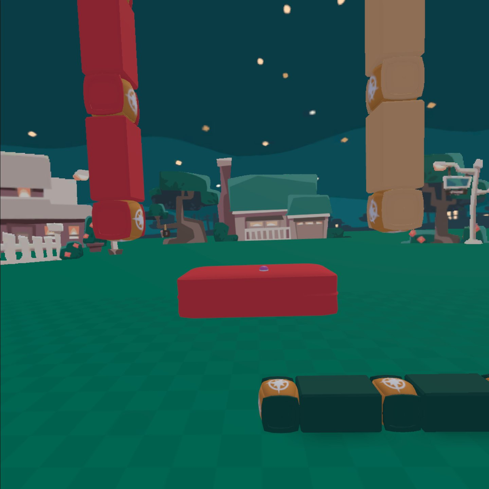
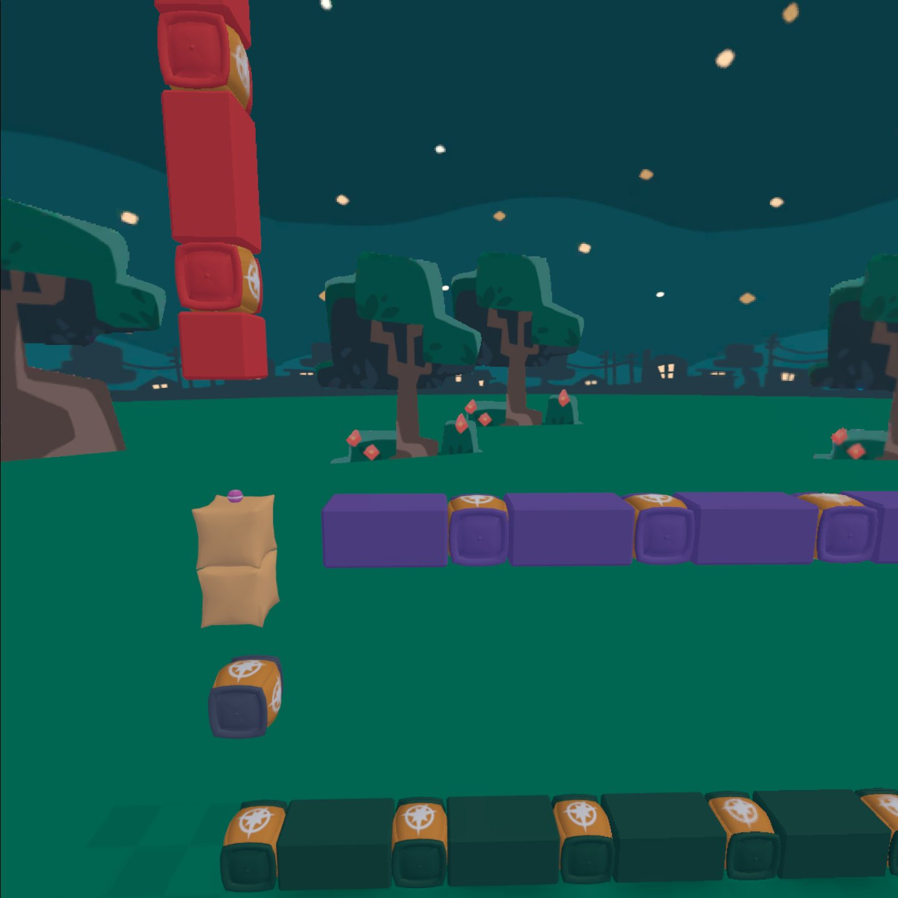
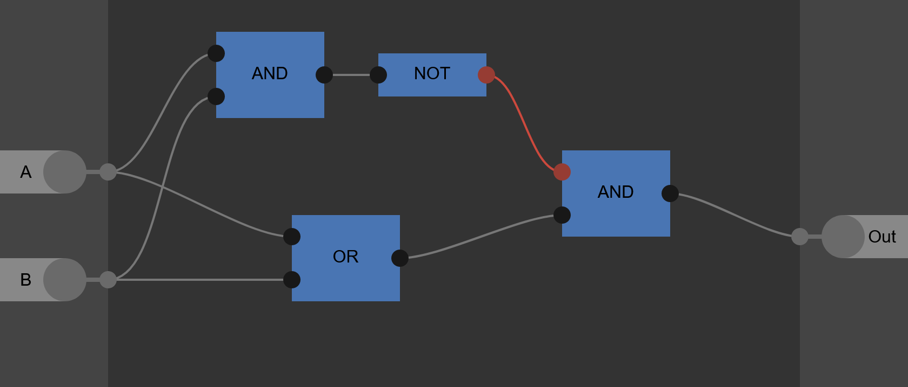
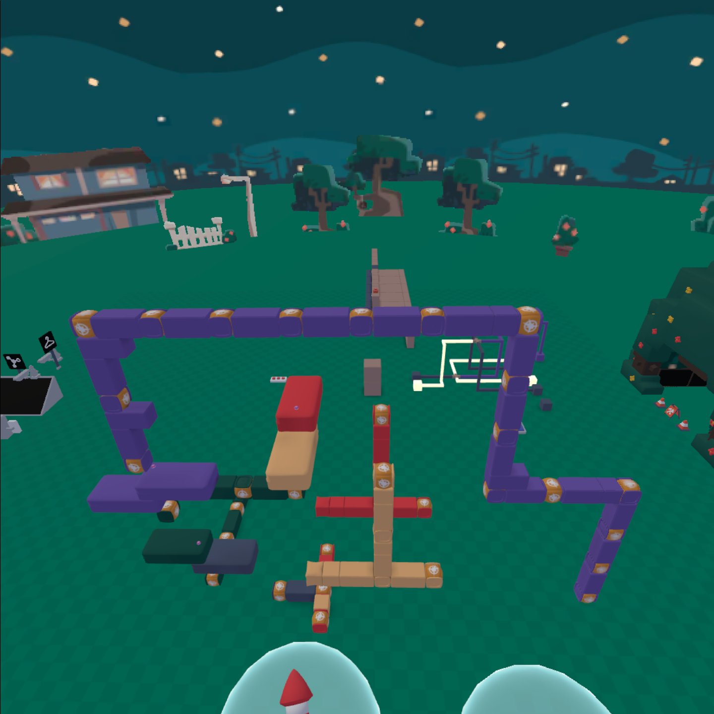
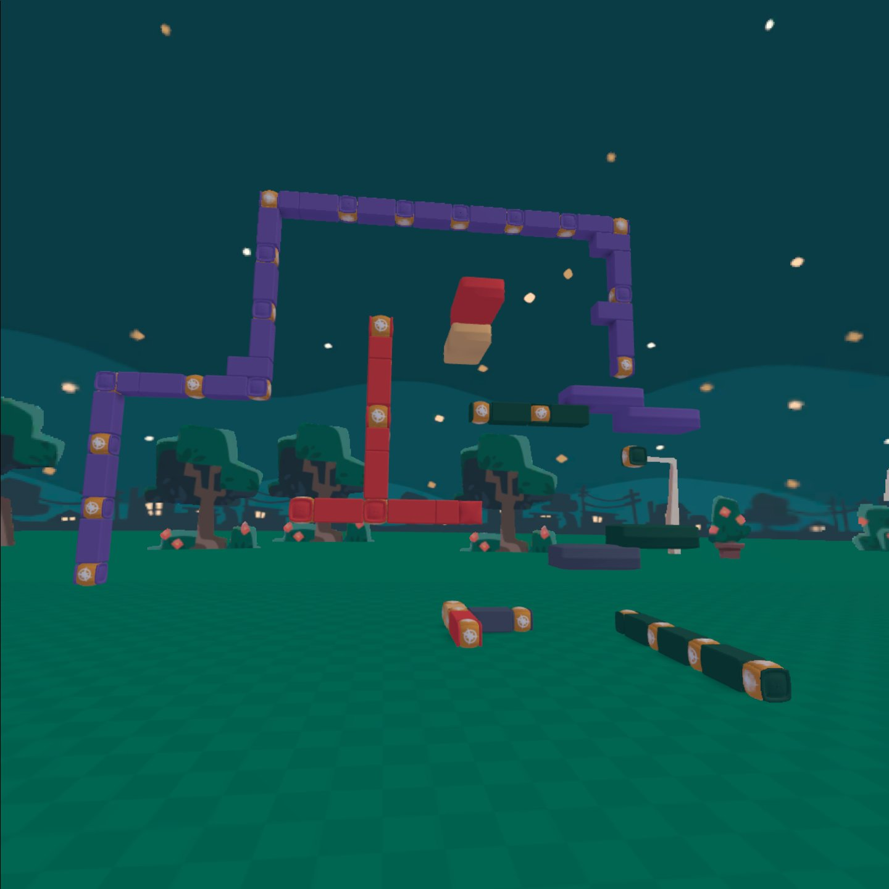

# Bomb Gates

## [Simple Gates](#simple-gates)

- Red = Input 1
- Yellow = Input 2
- Green = Output
- Purple = NOT Gate Trigger/Timer
- Internal Part of the Gate

----

## [AND Gate](#and-gate)
By far one of the simplest gates, just checking if it has received both inputs, the AND gate only consists of two long pillows, one pearl, and three explosives. When the explosives on both sides have gone off and destroyed both pillows, the pearl will be able to drop more than 3 blocks, allowing it to teleport the player, which will set off the next bomb chain by touching the bomb they landed on.

## [OR Gate](#or-gate)
Even simpler than the AND gate, the OR gate will just check if it has received either input, it consists of only a single long pillow, three explosives, and one pearl. When either of the bomb go off, they will destroy the pillow, allowing the pearl to fall and set off the next bomb chain like with the AND gate

## [NOT Gate](#not-gate)
The NOT gate has a single input that it inverts, but it is by far the most trouble-some gate, and it cannot just be setup like the others. Due to the way everything is setup and how explosion chains works, we can't just start an explosion chain if we don't get an input, which is what a NOT gate is supposed to do. To make them work, we must have a second explosion chain, which acts as a "timer/equals buttom", go and "check" if each NOT gate has recieved an input. If it has, then there will be no output, and vise-versa. 
### How to build

1. Place your output line at the bottom
2. Three blocks above that, place a bomb (line, two blocks of air, then bomb)
3. With a one block gap in-between, place two explodable blocks above that
4. Four blocks to the side, place the final bomb of the timer line
5. With a three block gap, place the final bomb to your input line
6. Place a pearl on top the the exploadable blocks

When the input line exploads, it destroys the top block, which drops the pearl. When the timer line goes by and destroys the remaining block, the pearl can't fall far enough to teleport the player and set off the chain. However, if the input line doesn't go off, the timer line is able to destroy both blocks and teleport the player to start the chain, effectivly inverting the input. With the way this gate works, the timer **cannot** reach the pearl at the same time, or before, the input line gets there, otherwise it will be treated as if there were no input.

----

## [Combo Gates](#combo-gates) 
These gate are made up of different combinations of the previous three gate, to provide different outputs

## [NAND Gate](#nand-gate)
The NAND gate is the exact same and a normal AND gate, but with a NOT gate on the end. If only one, or none of the inputs have been triggered by the time the timer comes around there will be an output, but if there are two inputs there will be no output.

[ADD NAND GATE IMAGE HERE]

##[NOR Gate](#nor-gate)
Similar to the NAND gate, a NOR gate is just an OR gate with a NOT gate on the end. If there are no inputs, there will be an output, but if there are any input, there will be no output

##[XOR Gate](#xor-gate)
The XOR gate, or the exclusive OR gate, will give an output if either of its inputs have been triggered, but not if both have. You can build on by arranging the gates like this (remeber the not gate trigger/timer):

This is one of the more compact XOR gates by JosFa

{width=360x}
{width=360x}

##[XNOR Gate](#xnor-gate)
The XNOR is almost the exact same as the XOR gate, except for, you guessed it..., theres a NOT gate at the end. If neither or both inputs triggered there will be an output, but if a single input is supplied there will be no output.
