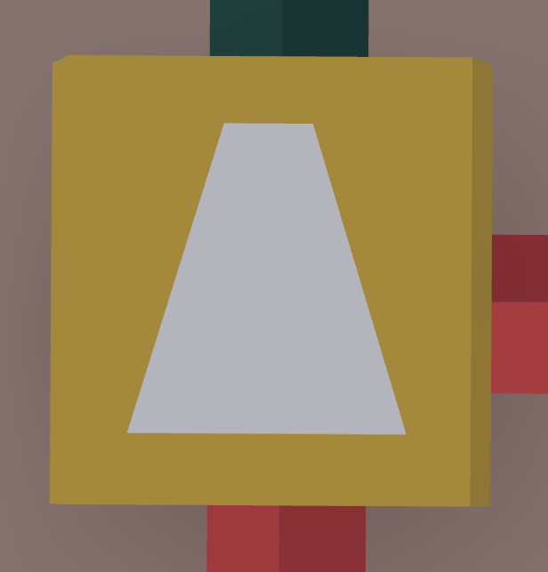
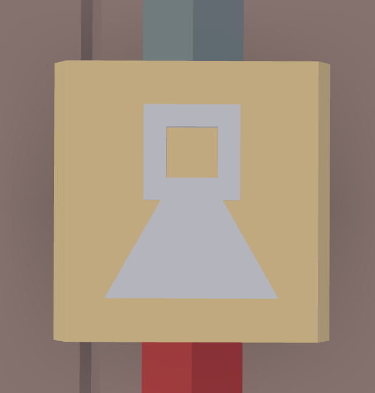
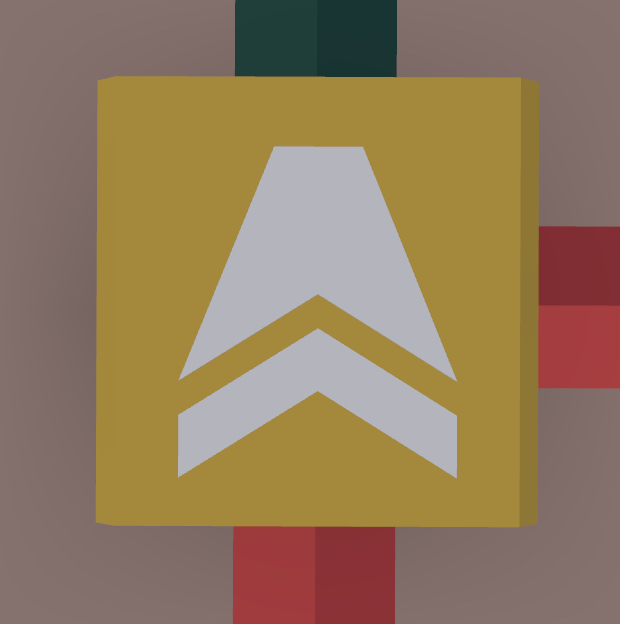
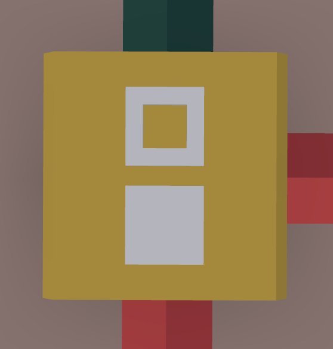
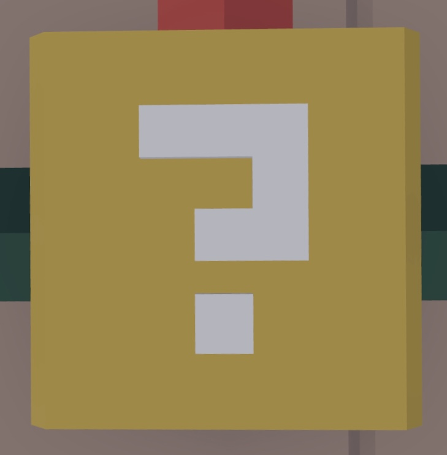

# Logic Gates

If you want a more in-depth and easier to understand explaination, check out [this amazing video](https://www.youtube.com/watch?v=mH6Pjvhk28c) by Ima_Rainbow.
He does an amazing job explaining what everything does, and how to use them

## AND Gate

{width=360x}

- Compares two inputs, one on the back and one on the side
- If **both** are on, it will give an output
- If not, no output will be given

Truth Table:

 Back | Side | Front
---|---|---
 Off | Off | Off
 Off | On | Off
 On | Off | Off
 On | On | On

## OR Gate

{width=360x}

- Compares two inputs, one on the back and one on the side
- If **either** are on, it will give an output
- If not, no output will be given

Truth Table:

 Back | Side | Front
---|---|---
 Off | Off | Off
 Off | On | On
 On | Off | On
 On | On | On

## NOT Gate

{width=360x}

- Has one input on the back, and inverts it
- If it gets powered, no output will be given
- If not, it will give an output

Truth Table:

 Back | Front
---|---
 Off | On
 On | Off

## XOR Gate

{width=360x}

- Compares two inputs, one on the back and one on the side
- Works similar to a [OR gate](#or-gate), but will not give an output if it receives power from both inputs

Truth Table:

 Back | Side | Front
---|---|---
 Off | Off | Off
 Off | On | On
 On | Off | On
 On | On | Off

## Toggle

{width=360x}

- When given an input from the back, it turns on or off
- If initially off, it will turn on
- If initially on, it will turn off
- There is an additional input on the side (marked in red) that will turn off the toggle, even if it was off already

## Randomizer

{width=360x}

- Takes one input, and gives two outputs on either side
- When powered, it will pause breifly, before randomly powering either side