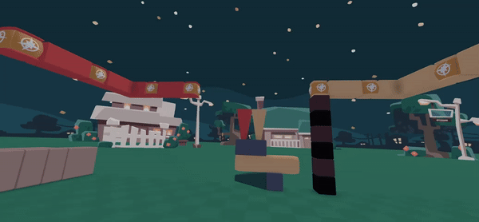

# Icicle Gates

## [**IMPORTANT**](#important)
Make sure your icicle gates do not send/recieve multiple inputs. This can and <u>***will***</u> breake these gates. It can be mitigated by placing a bomb that will set off an adjacent icicle, so if a second signal is sent, it will just fly off into nowhere. This is not an issue if you are using bombs as wires.

## [Simple Gates](#simple-gates)

- Red = Input 1
- Yellow = Input 2
- Green = Output
- Purple = NOT Gate Trigger/Timer
- Internal Part of the Gate

----

## [AND Gate](#and-gate)
By far one of the simplest gates, just checking if it has received both inputs, the AND gate only consists of three icicles, and one pillow. When the first icicle is triggered, it destorys the pillow blocking the other icicle from hitting the output. Any method should work to trigger the icicles (bombs, other icicles, frisbees, etc.) [Make sure your inputs don't receive multiple signals/triggers](#important), this will not be an issue if you use bombs to trigger the icicles like in the video below. The icicles can be a little buggy, and will not trigger the output if the dropped item is in the way, so it is recommended to build them flat on the ground until the bug is fixed, or use a 4 long block like shown below (this may not always work though).

## [OR Gate](#or-gate)
Even simpler than the AND gate, the OR gate will just check if it has received either input, it consists of only three icicles. When either input icicle is set off, they will trigger the output. [Make sure your output does not send multiple signals.](#important) When using icicles as an output, it is possible to send a second output if the second input is delayed enough, which may cause issues with the circuit. It is recommened to make it single use by setting off a bomb to trigger an adjacent icicle.

## There are currently no designs for NOT gates
If you've made one feel free to [fork this site](https://github.com/lrutjens/lrutjens.github.io/tree/src), add your changes, and submit a pull request! If you need any help or have submitted a pull request, you dm me @angryfool on discord, send a message in [our thread](https://discord.com/channels/1197017602292207666/1234241641272049795/1234241641272049795) in the [Yeeps: Hide and Seek Discord](https://discord.com/invite/yeeps), or email [angryfool@duck.com](mailto:angryfool@duck.com).

Combo gates will come soon aswell